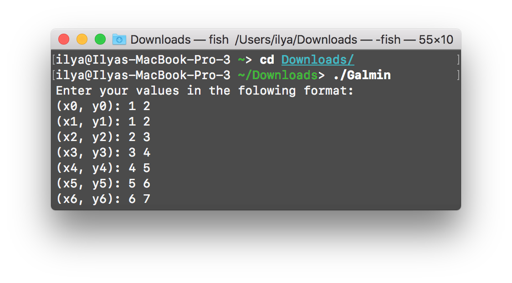
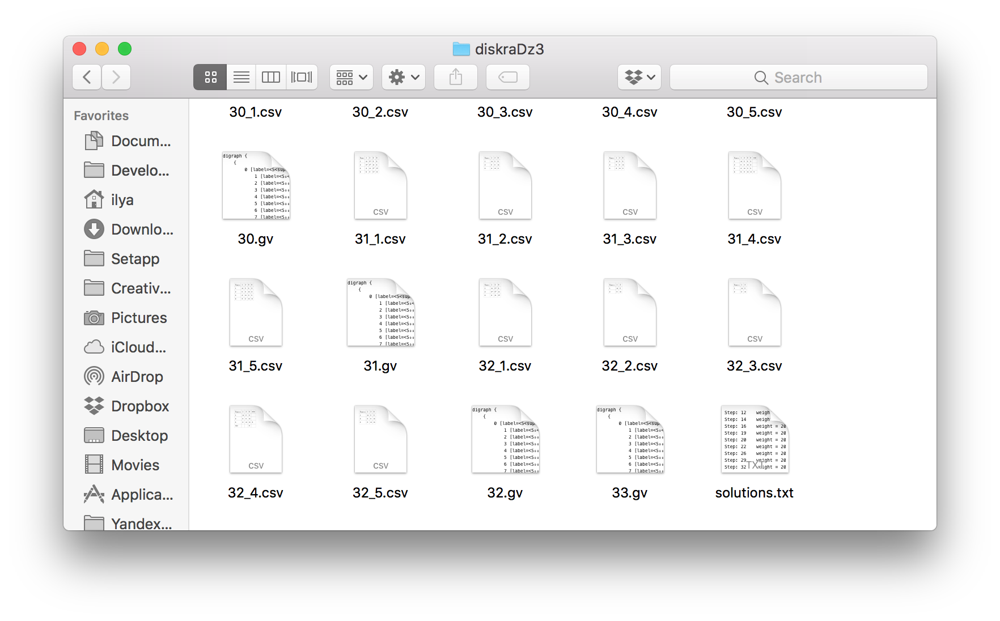
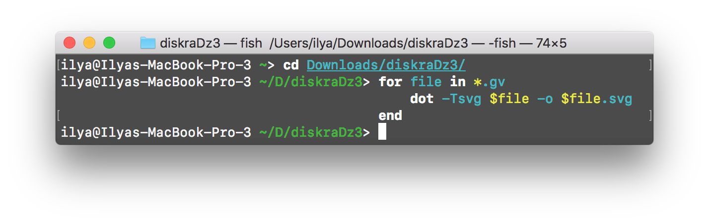
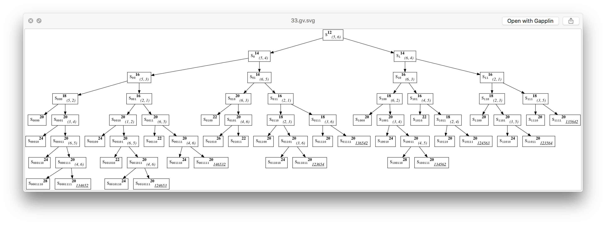

# DZ3

#### Данные материалы предоставлены исключительно для самопроверки :D

## Как запускать

Бинарка есть только на мак. На линукс статическую бинарку скомпилировать не получилось, но с динамическими библиотеками все работает. Хотите -- можете сами скачать и скомпилировать.

На винде вообще не знаю как работает. Можете попытаться что-то сделать, но если у вас винда, то вы все равно уже привыкли страдать...

## Galmin

Создает папку `diskraDz3` и пишет все туда. Если запускать двойным кликом, то папку создаст в `/`.

Рисует все деревья и все таблицы с минимизацией.

`.csv` файлы открываются в `Numbers` и оттуда их можно сразу вставить в `Pages`.

Деревья в формате [`GraphViz`](http://www.graphviz.org). Рассчитано все на перевод в `.svg`. В других форматах выглядит не так как надо.

В [`fish`](http://fishshell.com) можно обработать все разом.

[Вот бинарка на мак](https://github.com/ilyakooo0/Galmin/releases/download/v1.0/GalminMacOS.zip)

[Вот исходники](https://github.com/ilyakooo0/Galmin)